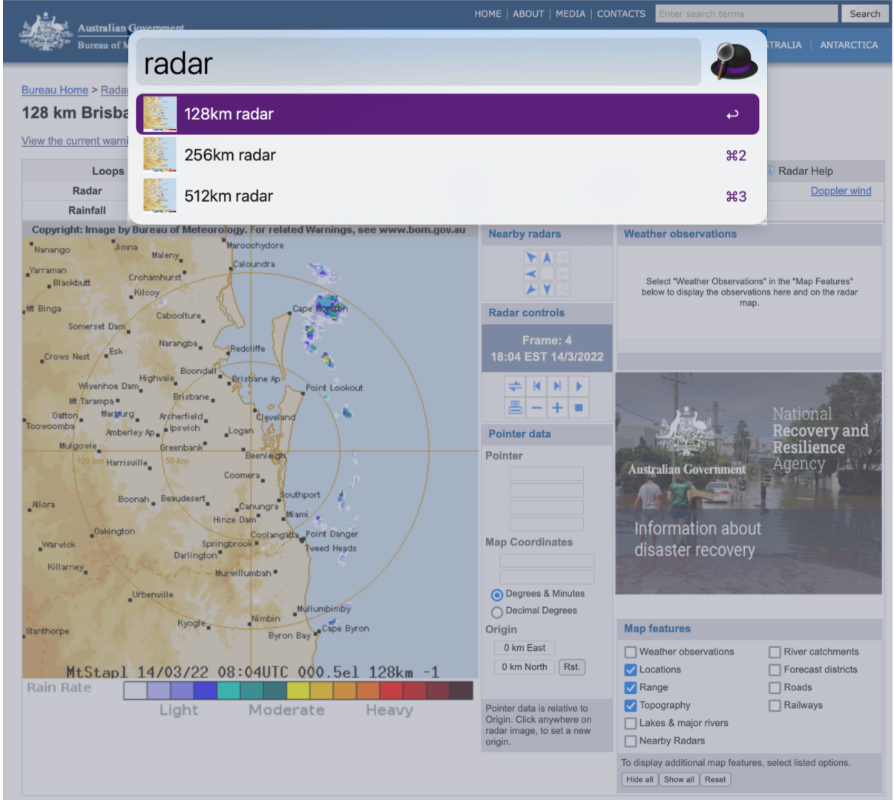

# Rain radar

Brisbane-oriented utility for [Alfred](https://alfredapp.com) to bring up the Bureau of Meteorology's rain radar.



## Installation

Ensure you have Alfred's paid [Powerpack](https://www.alfredapp.com/powerpack/) licence.

Double-click the `.alfredworkflow` file and follow the prompts.

## Usage

Press ⌘+space to launch Alfred, type one of the following, and press enter ↩.

```
radar 128

radar 256

radar 512
```
